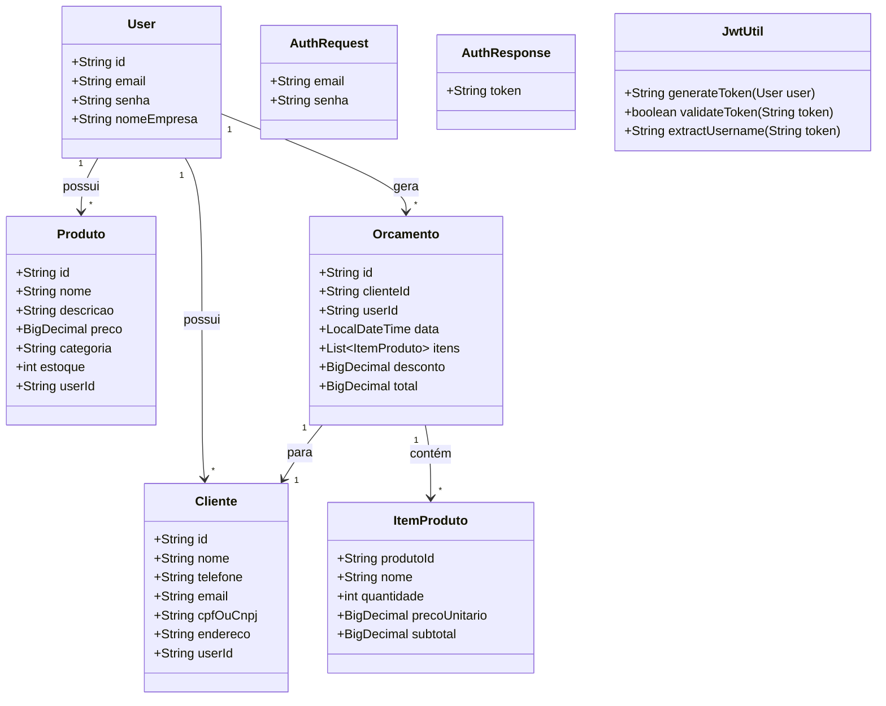

# Invoice Application
## Description
This is the invoice app backend 

## UML

```mermaid
classDiagram
    class User {
        +String id
        +String email
        +String senha
        +String nomeEmpresa
    }

    class Cliente {
        +String id
        +String nome
        +String telefone
        +String email
        +String cpfOuCnpj
        +String endereco
        +String userId
    }

    class Produto {
        +String id
        +String nome
        +String descricao
        +BigDecimal preco
        +String categoria
        +int estoque
        +String userId
    }

    class Orcamento {
        +String id
        +String clienteId
        +String userId
        +LocalDateTime data
        +List~ItemProduto~ itens
        +BigDecimal desconto
        +BigDecimal total
    }

    class ItemProduto {
        +String produtoId
        +String nome
        +int quantidade
        +BigDecimal precoUnitario
        +BigDecimal subtotal
    }

    class AuthRequest {
        +String email
        +String senha
    }

    class AuthResponse {
        +String token
    }

    class JwtUtil {
        +String generateToken(User user)
        +boolean validateToken(String token)
        +String extractUsername(String token)
    }

    User "1" --> "*" Cliente : possui
    User "1" --> "*" Produto : possui
    User "1" --> "*" Orcamento : gera
    Orcamento "1" --> "*" ItemProduto : contém
    Orcamento "1" --> "1" Cliente : para
```